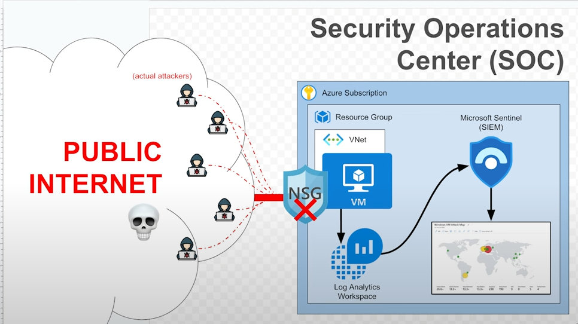

## Project Outcomes

This project is a crucial part of my hands-on learning journey to enhance my cybersecurity skills. The main outcomes I aim to achieve through this project include:

- **Azure Infrastructure Setup**: I will gain practical experience in configuring and deploying a secure, scalable Azure environment. This includes setting up Resource Groups, Virtual Networks, and Virtual Machines, which will provide me with a strong foundation in cloud infrastructure.

- **Security Monitoring**: I will configure and integrate security monitoring tools in Azure, such as Network Security Groups (NSGs) and Azure Sentinel. This will help me develop the skills needed to collect and analyse security logs, which are critical in identifying and responding to potential security threats.

- **Log Collection and Analysis**: By integrating Azure Sentinel with Log Analytics Workspace, I will centralize log collection from the honeypot VM. I will develop proficiency in using Kusto Query Language (KQL) to query logs and identify key security events like failed login attempts (Event ID 4625).

- **GeoIP Enrichment**: I will enhance my understanding of adding geographical context to security event logs through the use of GeoIP Watchlists in Azure Sentinel. This will allow me to better track the sources of potential attacks and improve my ability to detect attack patterns based on geographical data.

- **Attack Visualization**: I will create an interactive attack map to visually represent the distribution of failed login attempts. This will enable me to understand attack trends more intuitively and develop analytical insights into how security events are spread across different regions.

Through this project, I will strengthen both my technical skills in cloud security and my analytical thinking in threat detection and incident response. The integration of these tools and techniques will greatly enhance my cybersecurity knowledge and prepare me for real-world security challenges.

---

## Project Mapping

The following sections of the project outline detail the steps and tasks completed. Click on each section to navigate directly to it:

- [0.1-Tools-Used.md](0.1-Tools-Used.md): Overview of tools such as Azure Portal, Virtual Networks, NSGs, Sentinel, KQL, and GeoIP Watchlists used in the project.
- [0.2-Setup-Azure-Infrastructure.md](0.2-Setup-Azure-Infrastructure.md): Details the setup of the Azure environment, including creating the subscription, Resource Group, and Virtual Network.
- [0.3-Deploy-Honeypot-Virtual-Machine.md](0.3-Deploy-Honeypot-Virtual-Machine.md): Describes the deployment of the Windows 10 VM as the honeypot, configuring it to accept all traffic and simulate potential attacks.
- [0.4-Setup-Log-Collection-with-Azure-Sentinel.md](0.4-Setup-Log-Collection-with-Azure-Sentinel.md): Walkthrough of integrating Azure Sentinel and Log Analytics Workspace for centralized log collection and analysis of security events.
- [0.5-Enrich-Logs-with-GeoIP-Data.md](0.5-Enrich-Logs-with-GeoIP-Data.md): Step-by-step guide on how to import GeoIP Watchlists into Azure Sentinel and use KQL to enrich the security logs with geographical data.
- [0.6-Attack-Map-Visualization.md](0.6-Attack-Map-Visualization.md): Instructions on how to create an attack map using Azure Sentinel Workbooks, visualising the geographical distribution of failed login attempts.
- [0.7-Outcomes.md](0.7-Outcomes.md): Reflection on the project’s outcomes, summarizing key skills gained and tools mastered during the project.
- [0.8-Conclusion.md](0.8-Conclusion.md): Final thoughts on the project and its impact on my overall cybersecurity learning journey.
  
---

| **Skill**                             | **Description**                                                                                                                                                  | **Mapping**                                                                                  |
|---------------------------------------|------------------------------------------------------------------------------------------------------------------------------------------------------------------|---------------------------------------------------------------------------------------------|
| **Azure Infrastructure Setup**        | Configuring and deploying Azure resources like Resource Groups, Virtual Networks, and Virtual Machines to create a secure cloud environment.                    | [0.2-Setup-Azure-Infrastructure.md](0.2-Setup-Azure-Infrastructure.md)                       |
| **Security Monitoring**               | Implementing and managing security monitoring tools in Azure, including NSGs and Azure Sentinel for real-time log collection and analysis.                        | [0.4-Setup-Log-Collection-with-Azure-Sentinel.md](0.4-Setup-Log-Collection-with-Azure-Sentinel.md)|
| **Kusto Query Language (KQL)**        | Writing queries in KQL to analyze security logs and detect threats like failed login attempts (Event ID 4625).                                                   | [0.4-Setup-Log-Collection-with-Azure-Sentinel.md](0.4-Setup-Log-Collection-with-Azure-Sentinel.md)|
| **Log Analytics**                     | Configuring Log Analytics Workspaces in Azure to centralize log collection and analysis for security monitoring.                                                 | [0.4-Setup-Log-Collection-with-Azure-Sentinel.md](0.4-Setup-Log-Collection-with-Azure-Sentinel.md)|
| **GeoIP Enrichment**                  | Enriching security event logs with geographical data using Azure Sentinel's GeoIP Watchlist to provide more context for threat analysis.                          | [0.5-Enrich-Logs-with-GeoIP-Data.md](0.5-Enrich-Logs-with-GeoIP-Data.md)                     |
| **Attack Visualization**              | Using Azure Sentinel Workbooks to visualize attack data, particularly failed login attempts, and create geographic attack maps.                                 | [0.6-Attack-Map-Visualization.md](0.6-Attack-Map-Visualization.md)                           |
| **Incident Response**                 | Investigating and responding to potential security incidents by analyzing logs, identifying attack patterns, and making informed decisions.                      | [0.7-Outcomes.md](0.7-Outcomes.md)                                                           |
| **Cloud Security**                    | Understanding and implementing cloud-based security best practices, including network security and monitoring.                                                   | [0.1-Tools-Used.md](0.1-Tools-Used.md)                                                      |

--- 
