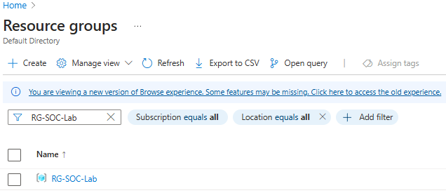
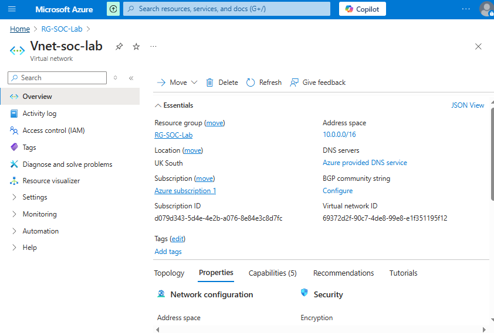

# Stage 1: Setup Azure Infrastructure

In this stage, I focused on establishing the foundational Azure environment to host the honeypot and ensure secure, isolated network operations. The key tasks involved setting up a cloud infrastructure using essential Azure services such as subscriptions, resource groups, and virtual networks.

## Create an Azure Subscription

To begin, I signed up for an Azure free trial with a $200 credit. This was ideal for my project, as it allowed me to explore various Azure services without immediate financial commitment. Once my subscription was active, I logged into the Azure Portal to begin the environment setup.

**Steps:**

- Signed up for the Azure free trial and activated my subscription.
- Set up the basic Azure environment.
- Defined subscription details and selected the UK South region for hosting resources.

## Create a Resource Group

A Resource Group (RG) is a fundamental part of organizing and managing resources in Azure. I created an RG named `RG-SOC-Lab`, which would serve as the central container for all resources associated with my honeypot project. Organizing resources into a resource group makes management, scaling, and access control much easier.

**Steps:**

- Navigated to the Azure Portal.
- Created a new Resource Group called `RG-SOC-Lab` in the UK South region.

## Deploy a Virtual Network (VNet)

Next, I deployed a Virtual Network (VNet) named `Vnet-soc-lab`. The VNet was crucial for isolating my honeypot VM and ensuring secure, internal communication within the Azure environment. For IP addressing, I used the address space `10.0.0.0/16` to ensure ample IP range for future scalability.

**Steps:**

- Created a Virtual Network (VNet) named `Vnet-soc-lab`.
- Assigned the address space `10.0.0.0/16` for internal IP addressing, allowing the VNet to support multiple subnets and devices in the future.

