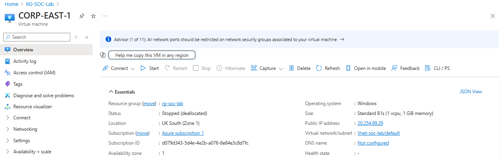
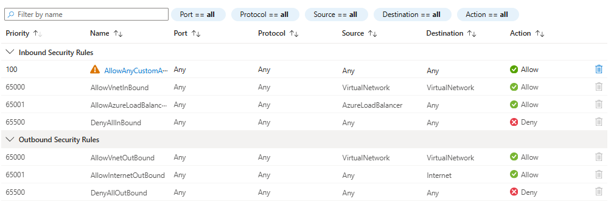
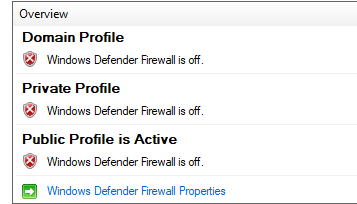

# Stage 2: Deploy Honeypot Virtual Machine

In this stage, I focused on deploying the honeypot VM to simulate an attack surface within my Azure environment. The honeypot VM was exposed to potential threats, making it a critical part of the overall security monitoring and analysis process. This step involved configuring the VM, network security settings, and firewall management.

## Deploy a Windows 10 VM

The first task was to deploy a Windows 10 Virtual Machine (VM), which would act as the honeypot. I chose the Standard B1s VM size, which provides 1 vCPU and 1 GiB of RAM—sufficient for simulating low-level attacks. For the VM's IP address, I used `10.0.0.4` within the allocated subnet to ensure static access.

**Steps:**

- Deployed a Windows 10 VM in Azure.
- Chose the Standard B1s VM size (1 vCPU, 1 GiB RAM) to meet the requirements of a honeypot.
- Noted down the username and password for secure access to the VM.
- Assigned a static IP (`10.0.0.4`) for consistent access to the machine.
- Connected to the VM using RDP (Remote Desktop Protocol) for initial configuration and setup.

## Configure Network Security Group (NSG)

To expose the honeypot for attack simulation, I configured a Network Security Group (NSG). I created an NSG named `Corp-East-1-nsg` and set up inbound and outbound rules to allow all traffic from any IP and port. This setup ensured that the honeypot would be vulnerable and open to potential malicious activities, simulating real-world attack scenarios.

**Steps:**

- Created an NSG named `Corp-East-1-nsg`.
- Set up inbound and outbound security rules to allow all traffic (priority 100).
- Applied the NSG to the VM’s network interface, ensuring unrestricted access to the honeypot for attack simulations.

## Disable Windows Firewall

To make the honeypot VM even more vulnerable, I disabled the Windows Firewall. This was an essential step in ensuring that the VM remained exposed to all traffic, providing an open attack surface for attackers to exploit. I accomplished this by using the `wf.msc` settings on the VM.

**Steps:**

- Logged into the VM using RDP and the noted credentials.
- Opened `wf.msc` (Windows Firewall settings) and turned off the firewall on all profiles (Domain, Private, and Public).

