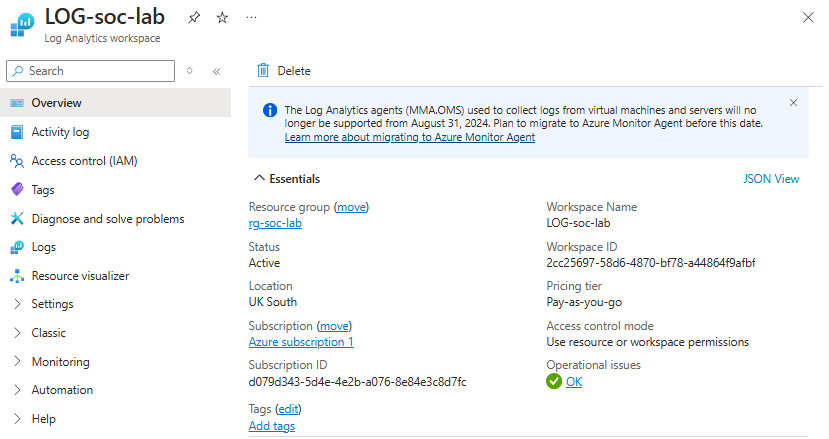
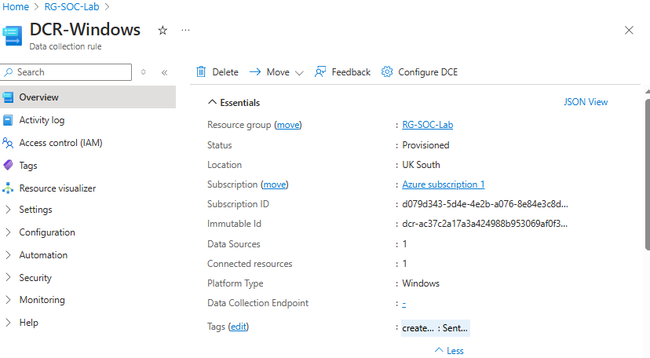

# Stage 3: Setup Log Collection with Azure Sentinel

In this stage, I focused on setting up Azure Sentinel and Log Analytics Workspace (LAW) to centralize log collection from the honeypot VM. This enabled monitoring and analysis of security-related events. By leveraging Azure Sentinel, I was able to collect and investigate logs, ensuring visibility into potential security threats targeting the honeypot.

## Create a Log Analytics Workspace (LAW)

The first step in setting up centralized logging was to create a Log Analytics Workspace. LAW is used to collect and query log data from various Azure resources, including virtual machines and integrated services like Sentinel.

**Steps:**

- Navigated to the Azure Portal.
- Created a Log Analytics Workspace (LAW) named `LOG-soc-lab` in the UK South region.



## Set Up Data Collection with Sentinel

The next step was to integrate Azure Sentinel with the LAW to begin collecting logs from the honeypot VM. I created a Sentinel instance, linked it to the workspace, and configured it to receive Windows Security Events via the Azure Monitor Agent (AMA) connector.

**Steps:**

- Created a Sentinel instance in the Azure Portal.
- Linked Azure Sentinel to the `LOG-soc-lab` Log Analytics Workspace.
- Configured the Windows Security Events via the AMA connector to forward logs from the honeypot VM, ensuring visibility into security-related events such as failed login attempts.

## Create the Data Collection Rule (DCR) in Sentinel

With the Sentinel instance configured, I created a Data Collection Rule (DCR) to define the types of events to be collected. The DCR is essential for ensuring comprehensive log collection from the VM.

**Steps:**

- Created a DCR named `DCR-Windows` in Sentinel.
- Configured the DCR to collect all Windows Security Events for detailed monitoring and analysis.



## Query Logs within the LAW

Once the logs were being forwarded to Sentinel, I used Kusto Query Language (KQL) to query the collected logs within the Log Analytics Workspace. This enabled me to search for specific security events and better understand how attack patterns manifest in log data.

**Steps:**

- **Intentional Action**: Triggered three failed login attempts on the honeypot VM using the username `"employee"` to simulate suspicious activity.
- Queried for Event ID `4625` (failed logins) in the Log Analytics Workspace using the following KQL:

```kql
SecurityEvent
| where EventId == 4625
```
