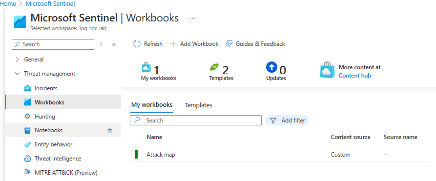

# Stage 4: Enrich Logs with GeoIP Data

In this stage, I enhanced the security event logs by associating geographical data (GeoIP) with the IP addresses captured in the event logs. This process involved importing a GeoIP Watchlist into Azure Sentinel to correlate IP addresses with their geographical locations. This added context to the logs, enabling more insightful threat analysis.

## Import GeoIP Watchlist into Sentinel

To enrich the logs with geographic information, I imported a GeoIP Watchlist into Azure Sentinel. This Watchlist contained data mapping IP addresses to geographical locations, allowing me to visually track where attacks were originating from.

**Steps:**

- Downloaded the `geoip-summarized.csv` file.
- Uploaded the file as a Watchlist in Azure Sentinel under the name `geoip`.
- Linked the Watchlist to event logs using KQL to enrich the security event logs with geographical data.



## KQL Query for GeoIP Enrichment

After importing the GeoIP Watchlist, I used the following KQL query to enrich the security logs—particularly Event ID `4625` (failed login attempts)—with geographical information:

```kql
let GeoIPDB_FULL = _GetWatchlist("geoip");
let WindowsEvents = SecurityEvent
    | where EventID == 4625
    | order by TimeGenerated desc
    | evaluate ipv4_lookup(GeoIPDB_FULL, IpAddress, network);
WindowsEvents
```
### Explanation

- **GeoIPDB_FULL**: Holds the imported GeoIP Watchlist.
- **ipv4_lookup**: Correlates the `IpAddress` in the event logs with geographic information from the Watchlist (e.g., country, region, city).
- **SecurityEvent**: Refers to the collected log data, particularly Event ID `4625` for failed login attempts.

The result is enriched log data that identifies the geographic origin of failed login attempts, providing valuable context for threat detection and analysis.
