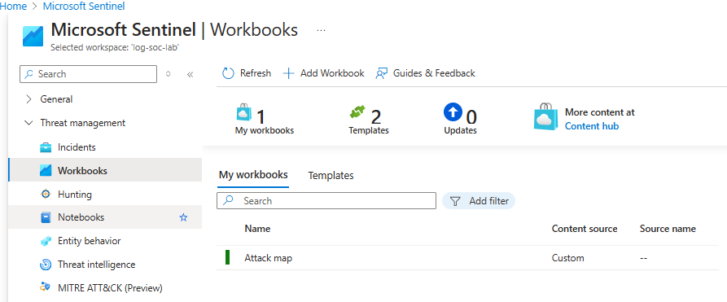
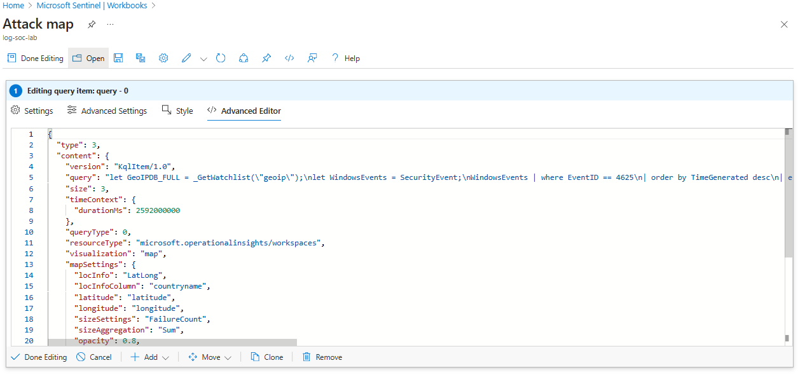

# Stage 5: Attack Map Visualization

In this stage, I created a visual representation of the attack data gathered from the failed login attempts to provide a more intuitive view of attack patterns. Using Azure Sentinel's Workbooks, I generated an attack map that showcased the geographical locations of failed login attempts, helping to visualise the scope and distribution of the attacks.

## Create an Attack Map Workbook

To visually represent the data collected from the security logs, I created a custom Attack Map within Azure Sentinel using a pre-provided `map.json` file. The map visualises the locations of failed login attempts using latitude and longitude data, which were enriched through the GeoIP Watchlist.

**Steps:**

- Created a Workbook in Azure Sentinel for visualising the attack data.
- Used KQL queries to generate data for the attack map, focusing on failed login attempts (Event ID `4625`).
- Customised the Workbook by adding a map visualisation and specifying parameters such as latitude, longitude, and failure count.
- Displayed the attack data using the `map.json` configuration to render the map.



## JSON Configuration for Attack Map

The pre-provided map.json defines how the attack data will be visualized on the map. Below is the configuration used:

```json
{
  "type": 3,
  "content": {
    "version": "KqlItem/1.0",
    "query": "let GeoIPDB_FULL = _GetWatchlist(\"geoip\");\nlet WindowsEvents = SecurityEvent;\nWindowsEvents | where EventID == 4625\n| order by TimeGenerated desc\n| evaluate ipv4_lookup(GeoIPDB_FULL, IpAddress, network)\n| summarize FailureCount = count() by IpAddress, latitude, longitude, cityname, countryname\n| project FailureCount, AttackerIp = IpAddress, latitude, longitude, city = cityname, country = countryname,\nfriendly_location = strcat(cityname, \" (\", countryname, \")\");",
    "size": 3,
    "timeContext": {
      "durationMs": 2592000000
    },
    "queryType": 0,
    "resourceType": "microsoft.operationalinsights/workspaces",
    "visualization": "map",
    "mapSettings": {
      "locInfo": "LatLong",
      "locInfoColumn": "countryname",
      "latitude": "latitude",
      "longitude": "longitude",
      "sizeSettings": "FailureCount",
      "sizeAggregation": "Sum",
      "opacity": 0.8,
      "labelSettings": "friendly_location",
      "legendMetric": "FailureCount",
      "legendAggregation": "Sum",
      "itemColorSettings": {
        "nodeColorField": "FailureCount",
        "colorAggregation": "Sum",
        "type": "heatmap",
        "heatmapPalette": "greenRed"
      }
    }
  },
  "name": "query - 0"
}
```
### Explanation of Key Fields

- **Query**: Retrieves failed login events (`Event ID 4625`) from the `SecurityEvent` table.
- **GeoIP Lookup**: Enriches the event data with GeoIP information including latitude, longitude, city, and country.
- **Visualisation**: A heatmap visualisation where node size represents the number of failed login attempts, and colour indicates intensity (green for low activity, red for high activity).


