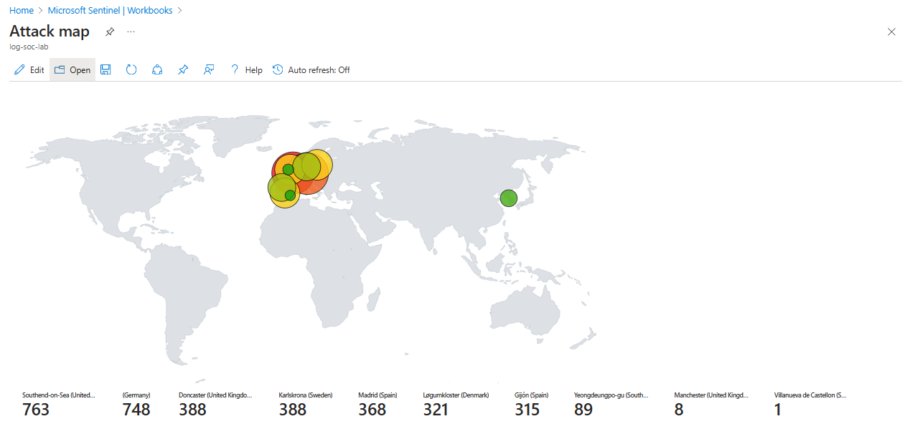

## Attacks Detected

Over a 5-hour period, the honeypot VM was subjected to a range of failed login attempts, simulating potential cyber-attacks. The following table outlines the distribution of attacks based on geographical locations, derived from the enriched GeoIP data and displayed in the attack map.

| Country              | Number of Attacks |
|----------------------|-------------------|
| United Kingdom (UK)  | 1,151             |
| Germany              | 748               |
| Sweden               | 388               |
| Spain                | 683               |
| Singapore            | 89                |

### Insights & Analysis

- **UK**: The highest number of attacks originated from the UK, with 1,151 failed login attempts, suggesting that this location may be a common source of automated or brute-force attacks on internet-facing systems.

- **Germany & Spain**: Both countries had a significant number of attacks, with Germany logging 748 and Spain 683. These figures may indicate the use of automated attack tools targeting multiple regions simultaneously.

- **Sweden**: Sweden recorded 388 failed login attempts. While lower than other countries, the activity remains notable and could suggest a more targeted or region-specific attack pattern.

- **Singapore**: With 89 attacks, Singapore registered the lowest number of failed login attempts, possibly reflecting fewer attackers from the region or lower botnet activity targeting the honeypot during the observation window.

### Attack Map

This geographical distribution was visualised in an attack map within Azure Sentinel, offering a clearer understanding of regional attack patterns. The heatmap highlighted areas of concentrated activity, with the UK and Germany emerging as prominent sources.

The visual insights underscore the value of geo-enrichment in log analysis, enabling the identification of attack hotspots and supporting more proactive, geographically-informed defence strategies.
