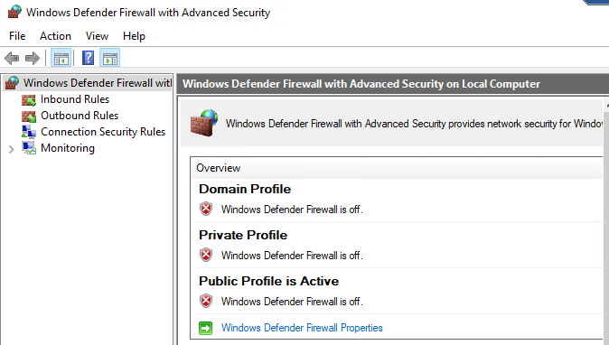
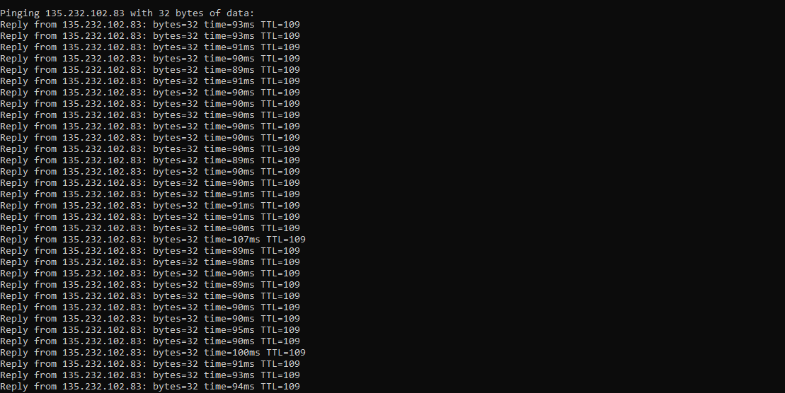
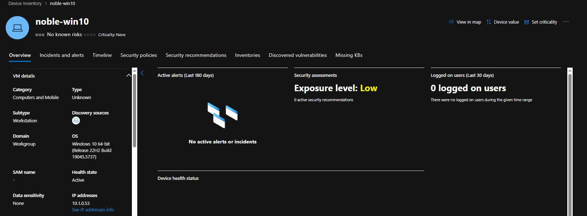

# Network Testing - Validating Isolation and Connectivity

## Objective
To simulate and validate live network exposure and containment using firewall, NSG settings, and ICMP traffic.

## Environment Details
- **Firewall Configuration**: Windows Firewall was disabled
- **NSG Settings**: Configured to allow all inbound traffic, including ICMP
- **Monitoring Tool**: Continuous ping from another host to track network isolation

## Testing Steps

### 1. Continuous Ping
Confirmed reachability of the VM before isolation.

### 2. Isolate Device
Using MDE’s "Isolate Device" feature, the VM was isolated from the network, and the ping stopped.

.png)

.png)

.png)

.png)

### 3. Release Isolation
Once the isolation was reversed, connectivity was restored.

## Outcome
The ping test verified successful containment of the endpoint from the network. This mirrors a real-world SOC response tactic where connectivity is restricted to halt lateral movement.

