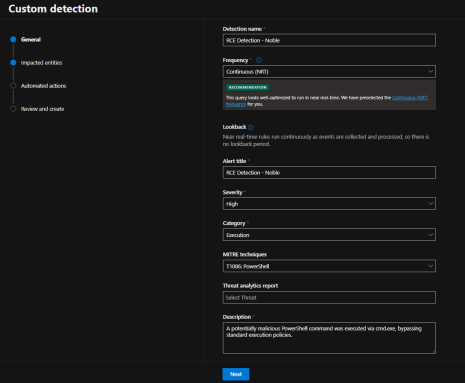
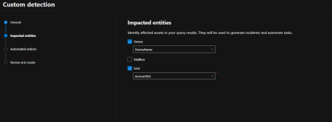
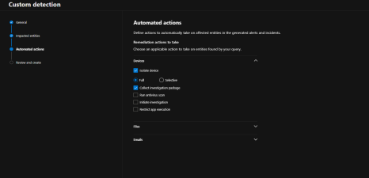

# Custom Detection Engineering

## 1. Create a Custom Detection Rule in MDE for PowerShell-based RCE

### 3.1 Write a KQL Query to Detect PowerShell with Invoke-WebRequest

The first step I took in creating a custom detection rule was to write a KQL (Kusto Query Language) query that would help detect suspicious PowerShell activity indicative of a Remote Code Execution (RCE) attack. Specifically, I targeted PowerShell commands that use `Invoke-WebRequest` to download files and `Start-Process` to execute them.

**Action:**

1. I opened the Microsoft Defender for Endpoint (MDE) portal at [https://security.microsoft.com](https://security.microsoft.com).
2. I navigated to **Advanced Hunting** under **Hunting** → **Advanced Hunting**.
3. I then entered the following KQL query to detect PowerShell commands that use `Invoke-WebRequest` to download files and `Start-Process` to execute them:

```kql
let target = "noble-win10"; 
DeviceProcessEvents 
| where DeviceName == target 
| where InitiatingProcessCommandLine has_all ("Invoke-WebRequest", "Start-Process")
```
### Explanation

- **DeviceProcessEvents**: This table logs every process running on the device. It allows me to track and monitor specific process activity, providing insights into the behavior of processes and the files they interact with.

- **Invoke-WebRequest**: This command is commonly used by attackers to download files from external sources, which can be malicious. I wanted to detect when this command is being used to pull down a malicious payload.

- **Start-Process**: After downloading a file, attackers often use this command to execute the downloaded file. I wanted to capture this activity as it indicates that the attacker is trying to execute the file, which could trigger the RCE attack.

### Purpose

The purpose of this query was to identify instances where PowerShell is being used to download and execute files, which is a common behaviour in RCE attacks. Detecting this activity is crucial for stopping the attack before it can escalate.

---

## 3.2 Create the Detection Rule in MDE

Once I had the KQL query set up, the next step was to create the custom detection rule in the MDE portal. This rule would monitor for the specific PowerShell commands in the query and trigger automated responses when the attack was detected.

### Action:

1. I navigated to **Custom Detection Rules** in the MDE portal.


2. I clicked on **+ Create Rule** to start the process of creating a new custom detection rule.

  

3. I configured the following settings for the rule:

- **Rule Name:** "Remote Code Execution - PowerShell 7-Zip Installer"
- **KQL Query:** I pasted the query I created in Step 3.1.

 

 

### Actions:

- **Isolate Device:** This action would automatically isolate the VM if the rule is triggered, preventing the attacker from further exploiting the device. The VM would be disconnected from the network to stop the spread of the attack.

- **Collect Investigation Package:** This action automatically collects detailed forensic data to help analyze the attack. The investigation package includes vital information such as process trees, file and registry changes, network connections, and event logs. This data is essential for understanding the scope of the attack and determining the best response.

4. After configuring the rule, I saved it and made sure that it was enabled to actively monitor for this type of attack.

By creating this custom detection rule, I was able to monitor for specific attack behaviours and automate responses to contain the threat quickly. This significantly reduced the manual effort required in handling such incidents.
