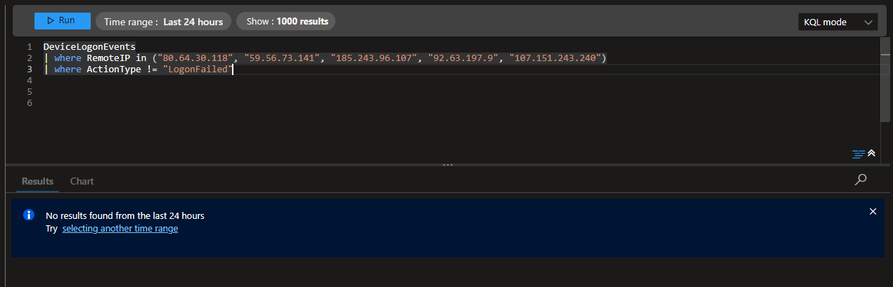

## Phase 3: 

### 1. **Validating the Outcome of the Detected Incident**

With the alert triggered and the investigation underway, my next step was to ensure that none of the flagged IP addresses had succeeded in breaching the environment. Although the detection focused on failed login attempts, it was necessary to rule out the possibility of a successful authentication attempt occurring after the initial detection window.

To do this, I executed a **post-validation KQL query** to examine any successful or non-failed logins from the identified IP addresses.

### 2. **Follow-Up KQL Query**

```kql
DeviceLogonEvents
| where RemoteIP in ("80.64.30.118", "59.56.73.141", "185.243.96.107", "92.63.197.9", "107.151.243.240")
// Filters the log data to only include the previously flagged brute force IPs
| where ActionType != "LogonFailed"
// Filters out failed logins — showing only successful or suspicious non-failure login events
```
## Query Breakdown and Validation Results

### Query Breakdown

- **DeviceLogonEvents**: Scans the device login event logs.
- **RemoteIP in (...)**: Narrows the scope to only the five IPs previously flagged by the brute force detection rule.
- **ActionType != "LogonFailed"**: Focuses on any activity that isn’t a failed login — specifically looking for successful or unauthorised login types.

---

### Results and Analysis

The query returned **no results**, confirming that none of the flagged IP addresses had successfully logged into any of the targeted Azure virtual machines. This was a critical validation step — without it, there would be uncertainty around whether the attack had escalated into a breach.



**Key Point**:  
This confirmation meant that the brute force attempts had been effectively blocked by the OS-level authentication controls. The Sentinel rule had provided early detection without false positives or overlooked escalation.


---

### Outcome

- The **follow-up validation query** confirmed that no successful logins occurred from the attacking IP addresses.
- No signs of **lateral movement**, **privilege escalation**, or **secondary compromise** were detected.
- The investigation was concluded with high confidence that the systems remained uncompromised and that the detection rule had worked as intended.

This phase marked the completion of the core technical investigation, validating that the rule successfully detected brute force activity without allowing a breach.
