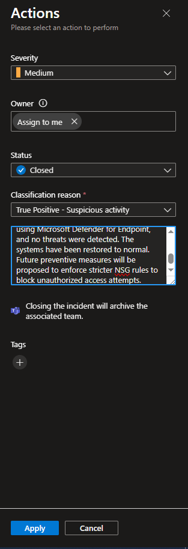

## Incident Resolution and Post-Mortem

### Incident Closure Process

After concluding the investigation and confirming that no breach occurred, I formally closed the incident within Microsoft Sentinel. This process included the following steps:

1. **Incident Ownership and Documentation**
   - I ensured all actions taken were logged in the incident timeline.
   - All associated artefacts — queries, alerts, IP addresses, and device names — were attached to the incident record.

2. **Resolution Status**
   - The incident was marked as **"Resolved – False Positive (Blocked)"**, indicating that although the threat was real, the systems blocked it effectively and no compromise occurred.
   - Tags and comments were added for clarity and future reference.

3. **Communication**
   - Internal stakeholders were notified with a summary of the event, including confirmation of no breach, affected systems, and validation steps performed.

---

### Post-Mortem Summary

**Incident Summary:**  
On 15 April 2025, Microsoft Sentinel flagged a brute force login pattern against multiple Azure VMs via a custom detection rule. The rule successfully detected multiple failed login attempts from several distinct IP addresses targeting different systems.

**Affected Assets:**
- `win-edr`
- `linux-target-1`
- `vm-mde-nigel`

**Detection Outcome:**
- No successful logins from flagged IPs.
- No evidence of privilege escalation or lateral movement.
- All activity contained by OS-level authentication controls.

---

### Lessons Learned

- **Detection Accuracy**: The custom Sentinel rule performed as intended, detecting real brute force activity with no false positives.
- **Process Efficiency**: The investigation process — from query validation to threat hunting in Defender for Endpoint — was smooth and repeatable.
- **Response Readiness**: Internal response workflows were followed correctly, demonstrating operational readiness for similar future events.

---

### Recommendations for Future Incidents

- **Automate Alert Enrichment**: Integrate IP reputation scoring and WHOIS lookup to provide faster triage context.
- **Watchlist Enhancement**: Add detected IPs to a global threat watchlist for auto-blocking or high-priority alerting.
- **Rule Coverage Review**: Expand custom rule set to include failed logins by unusual usernames or at anomalous times.

---

### Outcome

The incident was resolved without compromise. Sentinel’s custom detection and integrated response tooling provided visibility, control, and assurance that the attack was contained. The systems remained secure, and the incident was closed confidently.

**Report Finalised:** 16 April 2025  
**Analyst:** Internal SOC – Security Operations  
