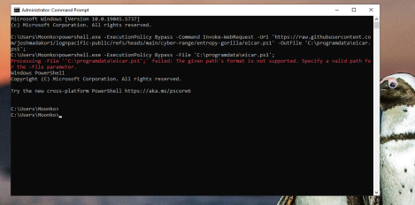

# Simulating a Suspicious PowerShell Event

To validate the effectiveness of the detection rule, a simulated attack was executed using a benign test payload. This allowed for safe end-to-end testing of alert generation and incident response capabilities within Microsoft Sentinel.

## Simulation Command

The following PowerShell command was run on the `noble-win10` endpoint:

```powershell
powershell.exe -ExecutionPolicy Bypass -Command Invoke-WebRequest -Uri 'https://raw.githubusercontent.com/joshmadakor1/lognpacific-public/refs/heads/main/cyber-range/entropy-gorilla/eicar.ps1' -OutFile 'C:\ProgramData\eicar.ps1';
powershell.exe -ExecutionPolicy Bypass -File 'C:\ProgramData\eicar.ps1';
```


## Why EICAR?

The **EICAR test file** is a safe, industry-standard file used to simulate the presence of malware without introducing real risk. It triggers antivirus detection mechanisms, making it ideal for testing detection rules and security tool responses.

## Objectives of the Simulation

- **Trigger the custom detection rule** by executing a suspicious PowerShell command that mimics real attacker behaviour.
- **Validate enrichment and alert grouping**, ensuring the SOC view includes useful context.
- **Test integration across the detection and investigation pipeline** — from alert generation to triage and post-incident reporting.

## Outcome

- The simulated command successfully triggered the detection rule.
- **Microsoft Sentinel** generated an alert enriched with contextual details:
  - Device name
  - Executed command
  - Associated user account

This confirmed that the detection logic was operational and capable of catching early-stage malicious behaviours.
