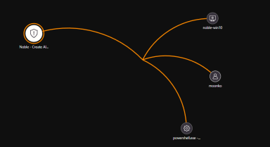

# Alert Trigger and Response Workflow

This section outlines the steps involved in responding to an alert triggered by the custom detection rule, covering the process from rule creation to incident closure.

## Rule Creation

The custom detection rule was configured within Microsoft Sentinel. Key features included:

- **Alert Grouping**: Alerts were grouped by `DeviceName` to reduce noise and prevent alert fatigue, especially in high-volume environments.
- **Enrichment Fields**: Enrichment with contextual fields such as `Hostname`, `Process Command Line`, and `Account Name` helps analysts quickly understand the scope of the incident without having to manually dig through raw logs.
  
These features aimed to streamline the process of identifying and responding to potential threats more effectively.

## Incident Triggered

After executing the suspicious PowerShell command on `noble-win10`, Sentinel successfully triggered an alert based on the detection rule. 

The alert included enriched contextual data such as:

- **Device Name**: Identifies the endpoint from which the suspicious PowerShell command originated.
- **Process Command Line**: The exact command used, providing insight into what the attacker (or simulated attacker) attempted.
- **Account Name**: The user account executing the command, allowing the response team to identify potential insider threat involvement or misused credentials.

## Taking Ownership

In a real-world scenario, the alert would be reviewed by a **Security Operations Centre (SOC) analyst** for further investigation. 

For the purpose of this simulation, I manually took ownership of the alert and proceeded to review the incident in detail. This included:

- **Assessing the alert context**: Using the enrichment fields, I quickly understood the scope of the potential attack.
- **Validating the trigger**: Ensuring that the rule triggered correctly by reviewing the raw logs and confirming that the `Invoke-WebRequest` command was executed by PowerShell.

## Investigation via Sentinel Map

Using Microsoft Sentinel’s **Investigation Map**, I traced the incident’s lifecycle. This tool provided valuable insights into:

- **Process ancestry**: Tracing the origins of the command and identifying any parent processes that could have initiated the suspicious PowerShell execution.
- **User account involvement**: Mapping the user account to see whether the action was legitimate or if a compromised account had been used.
- **Execution timeline**: Reviewing the sequence of events and timestamps to get a sense of the timeline and potential impact.

The **Investigation Map** was essential for visualising the event sequence and understanding how the attack (or simulation) progressed across the system.

## Containment, Eradication & Recovery

### Containment

To prevent further damage, immediate steps were taken to **contain** the threat. In a real-world scenario, the affected system would be isolated using **Microsoft Defender for Endpoint (MDE)** to block any further malicious activity and to prevent lateral movement. 

For the simulation, the following actions were taken:

- **Machine Isolation**: The test machine (`noble-win10`) was isolated within **Defender for Endpoint** to prevent any further exploitation or communication with external sources.
  
### Eradication

Next, we performed an **anti-malware scan** to check for any residual threats that could have been left behind by the simulation scripts.

- **Scan Details**: A full scan was initiated using MDE to verify the integrity of the system after the simulated attack. 
- **Simulation Findings**: Since the EICAR test file was used for the simulation, there were no real threats detected. However, in a real-world scenario, this would be where we would check for any malware remnants or scripts that may have been executed.

#### Script Execution Observations:
While no malicious scripts were executed, in a real-world scenario, if any scripts had been executed, they would be logged for further analysis.

Example:
- **Script `eicar.ps1` was observed to** execute and attempt to download additional files, which would then be flagged by the anti-malware system.
- **Script `exfiltratedata.ps1`** could potentially start a data exfiltration attempt if executed by the attacker’s PowerShell session.
  
If any scripts were executed, further analysis using **ChatGPT** or threat intelligence platforms would be performed to understand their functions and remove any persistent threats.

### Recovery

Once the system was isolated and the scan completed with no malware detected, the recovery phase commenced. 

- **System Restoration**: The test system (`noble-win10`) was restored to normal operation, and the isolation was lifted after ensuring no malicious activity persisted.
- **Post-Incident Verification**: All actions were documented, and the system was confirmed to be clean and free of any real threat. 

This simulated attack provided valuable insight into how well the detection and response pipeline works, highlighting areas for potential improvements in automation and speed of response.

---

Let me know when you're ready for the next section or if you'd like further edits!
